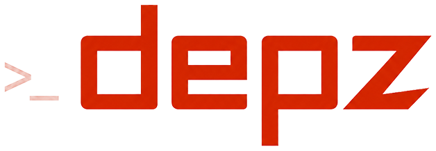

<h1>
  
</h1>

A CLI dependency manager for Zig projects.

depz wraps `zig fetch` with npm-style ergonomics: short repo specs, version tags, update checking, and registry selection — so managing `build.zig.zon` dependencies feels less manual.

> [!NOTE]
> **Early but usable.** The core commands work and are tested. Expect breaking
> changes before 1.0 — the CLI surface and `build.zig.zon` metadata may still shift.

```
depz — ergonomic dependency management for Zig

Usage:
  depz <command> [args]

  depz add <owner>/<repo>[@<tag>] [--as=<name>] [--registry=<host>]
  depz check [-u] [--all] [--target=<latest|minor|patch>]

Commands:
  add       Add a dependency to build.zig.zon (wraps `zig fetch --save`)
  list      List the dependencies declared in build.zig.zon
  check     Check dependencies against upstream, or update them with -u
  version   Show version info
  help      Show this help text

Options:
  -h, --help       Show this help text
  -V, --version    Print the version string
```

## Requirements

- **git** on your `PATH` — depz queries upstream tags and commits with `git ls-remote`.
- **Zig** on your `PATH` — `depz add` shells out to `zig fetch --save`. Developed against `0.17.0-dev.1441+d5181a9c9`; also verified on `0.16.0`.

## Install

```bash
curl -fsSL https://raw.githubusercontent.com/depz-org/depz-cli/main/install.sh | sh
```

Installs the latest release to `~/.local/bin`. Set `DEPZ_INSTALL_DIR` to install
elsewhere, or `DEPZ_VERSION` to pin a tag:

```bash
DEPZ_VERSION=v0.1.3 DEPZ_INSTALL_DIR=. sh install.sh
```

### Download a binary

```bash
# one of: x86_64-linux, aarch64-linux, x86_64-macos, aarch64-macos
TARGET=x86_64-linux   # or aarch64-linux, x86_64-macos, aarch64-macos
BASE=https://github.com/depz-org/depz-cli/releases/latest/download

curl -fsSL -O $BASE/depz-$TARGET
curl -fsSL -O $BASE/depz-$TARGET.sha256
sha256sum -c depz-$TARGET.sha256      # shasum -a 256 -c on macOS

chmod +x depz-$TARGET
mv depz-$TARGET ~/.local/bin/depz
```

### Or build from source

```bash
git clone https://github.com/depz-org/depz-cli
cd depz-cli
zig build
```

The binary lands at `zig-out/bin/depz`. Put it on your `PATH`, or run it directly.

## Usage

Run inside a Zig project (one with a `build.zig.zon`).

### Add a dependency

```bash
# a specific tag
depz add depz-org/example@v1.0.0

# latest commit on the default branch
depz add depz-org/example

# from a non-GitHub host
depz add foreverzer0/klack@v1.1.0 --registry=codeberg.org

# under a different name
depz add depz-org/example@v1.0.0 --as=depz_org_example
```

depz builds the `git+https://…` URL, runs `zig fetch --save`, and lets Zig
resolve and pin the exact commit into `build.zig.zon`.

`--as` matters when two dependencies come from repos that share a name —
without it, the second overwrites the first with no warning.

GitHub is the default host. `--registry` overrides it for a single command, and
a project-level `.depz = .{ .registry = "…" }` in `build.zig.zon` changes the
default for the whole project.

### List dependencies

```bash
depz list
```

```
7 dependencies

  example             v2.0.0          
  httpz               git (52eb187c)
  dataformats         git (6ea14105)
  klack               git (78bd4ba5)
  depz_org_example    git (354309b9)  
  libxev              git (9ce8e8e6)
  @"tiny-regex-c"     git (f2632c6d)
```

### Check for updates

```bash
depz check
```

```
Checking 7 dependencies

  example             v1.0.0  → v2.0.0
  depz_org_example    v1.0.0  → v2.0.0

5 up to date. Run with --all to show them.
```

Only outdated dependencies are shown by default; `--all` includes the rest.

`--target` bounds how far to look for an update: `minor` stays within the
current major version, `patch` within the current minor. The default, `latest`,
accepts any newer tag.

Pass `-u` to apply the updates instead of only reporting them.

Tag-pinned dependencies are compared by version, dependencies tracking a branch
by commit. Pre-release tags are skipped.
## How it works

depz is a thin layer over Zig's own tooling — it does not host packages or run a
registry. `add` delegates downloading and hashing to `zig fetch --save`; update
checks read the pinned ref from each dependency's URL and query the upstream git
host with `git ls-remote`. Everything lives in your existing `build.zig.zon`.

## License

Dual-licensed under [Apache-2.0](LICENSE-APACHE) or [MIT](LICENSE-MIT), at your option.

Contributions are welcome and, unless you state otherwise, are understood to be
dual-licensed under the same terms.